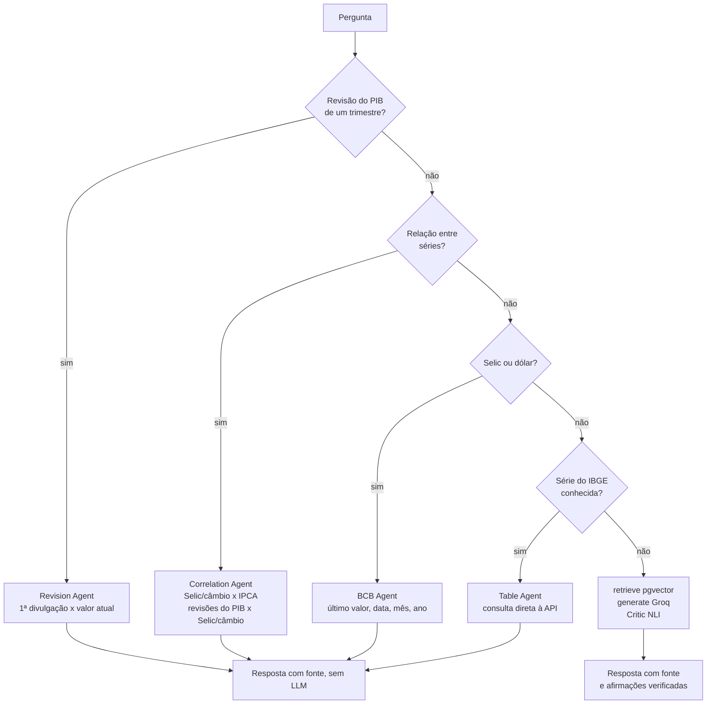

# IndicaLens

**Perguntas sobre indicadores econômicos do Brasil, respondidas com a fonte em cada número e com as afirmações do modelo conferidas contra os dados.**

[](https://github.com/arthursobral/indicalens/actions/workflows/ci.yml)

**Demo online:** <https://indicalens.streamlit.app/> (plano gratuito; veja [o estado da demo](#demo-online) antes de testar perguntas que usam o LLM)

O IndicaLens lê dados públicos do **IBGE** (IPCA, PIB, PNAD Contínua, pobreza) e do **Banco Central** (Selic e câmbio) e responde em português. Números pedidos diretamente saem de **código determinístico**, sem LLM, para não poderem ser inventados. Perguntas sobre os *comentários* do IBGE passam por busca + LLM, e um agente **Critic** confere cada afirmação da resposta contra os trechos recuperados. Também calcula relações entre séries (Selic × inflação, câmbio × inflação, revisões do PIB × Selic/câmbio) e **diz quando não há evidência**.

---

## Por que este projeto existe

- **LLMs inventam números.** Em economia, um número errado com cara de certo é pior que nenhuma resposta. A saída aqui é *não deixar o modelo produzir o número*: valores vêm de consulta por código, e o LLM só entra onde há texto para resumir.
- **Análise de indicadores é trabalho manual e espalhado.** Achar o valor, o período certo, a série certa, o caderno em PDF do IBGE e cruzar com Selic e câmbio leva tempo. Aqui é uma pergunta.
- **Portfólio com evidência.** Em vez de "usei um LLM", o repositório mostra RAG com verificação, orquestração multi-agente (LangGraph), um harness de avaliação que barra regressões no CI e resultados estatísticos reportados com honestidade, inclusive os negativos.

Custo de manutenção e de demonstração: **US$ 0** (Supabase, Groq, Streamlit Cloud e GitHub Actions em planos gratuitos; os modelos de embeddings e de NLI rodam localmente).

---

## Exemplos

Todos os exemplos abaixo são saídas reais do sistema (20/09/2026).

### Sem LLM (código determinístico, ~1 s)

| Pergunta | Resposta |
|---|---|
| Qual foi o IPCA mais recente? | `IPCA - variação mensal, agosto de 2026: -0.32%.` |
| Qual foi a taxa de desocupacao em maio de 2025? | `PNAD Contínua - taxa de desocupação, trimestre móvel encerrado em maio de 2025: 6.2%.` |
| qual a taxa selic de novembro de 2022? | `Meta Selic ao fim de novembro de 2022: 13,75% a.a. (em 30/11/2022); Selic acumulada no mês: 1,02% (SGS 4390) (Banco Central, SGS 432).` |
| O PIB do 2 trimestre de 2022 foi revisado? | `... primeira divulgacao 3.2%, valor atual 3.5% - revisado para cima em 0.3 p.p.` |
| selic em março | `Você citou um mês sem o ano. Informe o ano (por exemplo, "março de 2022").` (recusa em vez de adivinhar o ano) |

**Correlação** (`O cambio afeta o IPCA?`), também sem LLM:

```
Correlação entre a variação percentual mensal do dólar e o IPCA mensal (jan/2000 em diante):
- Mesmo mês: r = -0,03 (IC 95%: -0,14 a 0,08; n = 320 meses).
- Maior correlação entre as defasagens 0 a 12 meses: 4 mês(es) de defasagem, r = 0,26
  (fraca; IC ajustado por múltiplas defasagens: 0,10 a 0,40; n = 320).
- Diferente de zero mesmo depois de ajustar pelas defasagens testadas.
Correlação não prova causa: o câmbio também reage às expectativas de inflação e juros...
Fontes: IBGE/SIDRA tabela 1737 (IPCA); Banco Central, SGS 3695 (...)
```

Para `A inflacao se move junto com a Selic?` o resultado é o oposto: r = 0,13, **"não é distinguível de zero depois de ajustar pelas defasagens testadas: não há evidência de relação linear"**.

### Com LLM (busca nos comentários do IBGE + Critic)

Pergunta: `O que os comentarios do IBGE dizem sobre a populacao ocupada?`

> Os comentários do IBGE sobre a população ocupada no 2.º trimestre de 2026 indicam que a maior parte dos empregados está no setor privado, representando 74,2% do total. O setor público corresponde a 18,2% e o serviço doméstico a 7,6% dos trabalhadores ocupados. [2]
>
> *Busca + LLM + Critic · 893 → 347 tokens · Critic: 0 de 3 afirmações sinalizadas*

Quando o Critic discorda, a resposta traz um bloco `[Critic] Afirmações não sustentadas pelas fontes recuperadas:` listando as frases. Outras perguntas que usam o LLM: `O que os comentarios do IBGE dizem sobre a desocupacao?`, `O que os comentarios do IBGE dizem sobre o rendimento?`.

### Onde o sistema se recusa

| Situação | Comportamento |
|---|---|
| Ano sem mês numa série mensal (`taxa de desocupacao em 2024`) | não responde "o mais recente" no lugar; cai para a busca e admite que não há dados |
| Mês sem ano, data inexistente (30/02), data futura | mensagem explícita, sem número |
| Relação entre indicadores fora do escopo (ex.: dólar × desocupação) | "só sei relacionar com o IPCA", sem número |

---

## Como funciona



O grafo (LangGraph, `src/qa_agent.py`) tenta os agentes determinísticos primeiro; só o que sobra vai para a busca + LLM.

| Módulo | O que faz |
|---|---|
| `src/table_agent.py` | Lookup por série e período (IPCA, PIB, PNAD, pobreza, PME); recusa período ambíguo em vez de adivinhar |
| `src/bcb_agent.py`, `src/bcb_client.py` | Selic (meta, SGS 432) e dólar (SGS 1) mais recentes ou de uma data/mês/ano; séries mensais para a correlação |
| `src/correlation.py` | Selic/câmbio × IPCA: variações (não níveis), defasagens 0–12, IC de Fisher ajustado por Bonferroni |
| `src/revisions.py`, `src/revision_effects.py` | Revisões do PIB com **mesma idade**, a partir dos cadernos do IBGE, e teste contra Selic/câmbio (permutação + controle "antes") |
| `src/critic.py` | Divide a resposta em afirmações e verifica cada uma contra os trechos (NLI local); classifica em sustentada, não sustentada, contradita ou *inferida* |
| `src/ingest.py`, `src/notes.py`, `src/indicator_analyst.py` | Ingestão das séries, dos comentários em PDF e classificação de tema (zero-shot) |
| `src/batch.py` | Um relatório `.md` por indicador, com tempo, tokens e alertas do Critic |
| `src/tracing.py` | Traces opcionais no Langfuse (um span por passo do grafo) |
| `app.py` | Interface Streamlit |
| `eval/` | Harness de avaliação (gate no CI) |

---

## O que escolhemos (e por quê)

- **Números por código, não por LLM.** Tentamos primeiro um modelo de perguntas sobre tabelas (TAPAS); ele é só inglês e devolveu resposta vazia em português. Como as séries são tabelas simples de período → valor, uma consulta parseada é mais simples e mais confiável.
- **Recusar é melhor que adivinhar.** A família de bugs mais frequente foi "período não reconhecido vira o mais recente, em silêncio". Hoje um ano sem mês, um mês sem ano ou uma pergunta com dois períodos recebem tratamento explícito, cada caso coberto por teste.
- **Um Critic que separa erro de inferência.** Um NLI local confere cada afirmação. Conclusões razoáveis ("portanto…") aparecem à parte, e só se todos os números já estiverem na fonte: um número errado nunca se esconde atrás de um "portanto".
- **Estatística sem se enganar.** Correlação em *variações*, não em níveis (em 60 pares de passeios aleatórios independentes, 85% pareciam relacionados nos níveis e 7% nas variações). Com 13 defasagens testadas, o intervalo da melhor é alargado (Bonferroni). Revisões do PIB comparadas com a **mesma idade**, para não confundir revisão com tempo decorrido.
- **Avaliar o avaliador.** O harness tem casos plantados, um oráculo independente em numpy para a correlação, fatos-ouro escritos à mão e um conjunto *held-out* para o reconhecimento de perguntas. Isso revelou que o reconhecimento por palavras-chave acertava 100% nas frases de desenvolvimento e **40% nas frases novas**; a regra foi trocada e medida em um conjunto novo.
- **CI hermético.** O gate roda contra dados gravados (`eval/fixtures/`), sem rede e sem segredos, porque a API do IBGE dava timeout no CI e testes "passavam pulando".
- **Stack gratuita, com modelos locais.** Supabase (Postgres + pgvector), Groq (`openai/gpt-oss-20b`), embeddings `all-MiniLM-L6-v2` e NLI `mDeBERTa-v3-base-mnli-xnli` rodando na própria máquina.
- **Sem índice vetorial aproximado.** Um ivfflat criado com a tabela vazia devolvia zero linhas; com ~1 200 documentos, a busca exata basta.
- **API do IBGE v3 (`servicodados`).** A `apisidra` fica atrás de um desafio do Cloudflare que bloqueia clientes HTTP simples.

---

## Resultados medidos

| O quê | Resultado |
|---|---|
| Consulta a séries do IBGE (60 casos, oráculo independente) | 100% |
| Recusas corretas (25 casos: ano ambíguo, antes da série, várias datas…) | 100% |
| Lookup do BCB contra 11 fatos escritos à mão (ex.: meta Selic em 31/12/2022 = 13,75%) | 100% |
| Correlação vs oráculo em numpy (2 pares reais) | igual até 1e-9 |
| Defasagem plantada de 3 meses recuperada (40 sementes) | 100% |
| Afirmações do LLM sustentadas pelas fontes (69 afirmações rotuladas à mão) | 87% (critério estrito) a 94% |
| Critic: erros reais detectados / alarmes falsos | 3 de 4 / 10 de 65 |
| Selic × IPCA (jan/2000+, 320 meses) | r = 0,13, **não distinguível de zero** |
| Dólar × IPCA | r = 0,26 com 4 meses de defasagem, fraca (~7% da variância) |
| Revisões do PIB, 1 divulgação depois | só 5 de 25 trimestres revisados (todos 2º tri) |
| Revisões do PIB, 1 ano depois | 19 de 22 revisados, 18 para cima (+0,29 p.p. em média) |
| Revisões do PIB × Selic/dólar em 90 dias | **sem evidência** (p = 0,66 e 0,84); teste de baixo poder (24 divulgações, 6 com revisão) |
| Batch local: 6 relatórios | 40 s no total, ~320 tokens de entrada e ~150 de saída por relatório, US$ 0 |

O gate offline do CI tem 16 métricas e reprova o PR se qualquer uma cair abaixo do piso.

---

## Limites conhecidos

- **Demo na nuvem gratuita: perguntas com LLM são muito lentas.** Veja [Demo online](#demo-online).
- O faithfulness *automático* em respostas novas (0,68) é um piso pessimista: o Critic sinaliza cerca de 1 em cada 3 afirmações, enquanto ~6% são erros de verdade. O número confiável vem das afirmações rotuladas, e são só 69, com 4 erros reais (um recall de 3 de 4 não tem poder estatístico).
- Correlação não prova causa (a Selic também reage à inflação), e meses vizinhos não são independentes, então os intervalos tendem a ser otimistas.
- Correlações só com o IPCA por enquanto; PIB e PNAD exigem tratamento extra (trimestres móveis sobrepostos, frequência trimestral).
- O teste de revisões do PIB × Selic/câmbio tem pouco poder: "sem evidência" não é "sem efeito".
- Comentários do IBGE sobre **informalidade** não são recuperados pela busca (a resposta é "não há dados suficientes").
- O reconhecimento de perguntas de correlação é por regras: perguntas mistas sem sinal de "valor pontual" viram correlação.
- Não é recomendação de investimento.

---

## Demo online

**<https://indicalens.streamlit.app/>**, no plano gratuito do Streamlit Community Cloud.

- **Consultas diretas e correlação:** funcionam no site público (IPCA mais recente em ~1,6 s; câmbio × IPCA em ~3,7 s).
- **Perguntas com LLM + Critic:** funcionam, mas são **muito lentas na hospedagem gratuita**: a primeira levou 294 s (baixar e carregar os modelos, ~2 min, mais a inferência) e a segunda, com os modelos carregados, passou de 100 s sem terminar (localmente: 10 a 30 s). Os logs não mostram erro nem falta de memória; o gargalo é a CPU. Em investigação.
- O app dorme depois de alguns dias sem visitas; a primeira visita o acorda (~30 s).
- Limite de 15 perguntas por sessão, para proteger a cota gratuita do LLM.

---

## Como rodar

### 1. Banco e chaves

1. Crie um projeto gratuito no [Supabase](https://supabase.com), habilite a extensão `pgvector` e rode [scripts/schema.sql](scripts/schema.sql) no SQL editor.
2. Copie `.env.example` para `.env` e preencha `DATABASE_URL` (Supabase → Connect). Para o LLM, use `GROQ_API_KEY` (gratuito em [console.groq.com](https://console.groq.com)) ou deixe em branco e rode um [Ollama](https://ollama.com) local.
3. (Opcional) Chaves do [Langfuse](https://cloud.langfuse.com) para ver, por pergunta, cada passo do grafo, latência e tokens. Sem as chaves, nada é enviado.

### 2. Dependências e dados

```bash
python -m venv .venv
.venv/Scripts/pip install -r requirements.txt     # Windows; em Linux/macOS: .venv/bin/pip
python -m src.ingest             # séries tabulares (histórico completo)
python -m src.notes              # comentários do caderno trimestral do IBGE
python -m src.indicator_analyst  # tema de cada comentário (zero-shot)
python -m src.revisions          # revisões do PIB
python -m src.revisions --vintages   # (opcional) atualiza data/pib_vintages.json quando sai caderno novo
```

### 3. Usar

```bash
.venv/Scripts/python -m streamlit run app.py                                   # interface web (http://localhost:8501)
.venv/Scripts/python -m src.qa_agent "Qual foi o IPCA mais recente?"           # linha de comando
.venv/Scripts/python -m src.batch --only IPCA,PIB                              # relatórios em reports/
```

Variáveis opcionais da interface: `MAX_QUESTIONS_PER_SESSION` (padrão 25) e `CRITIC_ENABLED=0` (pula o modelo NLI, ~1 GB de RAM; a interface avisa que o Critic está desativado).

### 4. Testes e avaliação

```bash
python -m eval.run --tier offline --gate   # o gate do CI: sem rede e sem segredos (IBGE + BCB + correlação + revisões)
python -m eval.run --tier full             # local: grafo inteiro com Groq + Supabase + Critic
python tests/test_table_agent.py           # e os demais em tests/; o CI roda todos, exceto os que baixam modelos
```

`--live` roda o gate contra a API real e `--record` regrava as fixtures.

---

## Estrutura do repositório

```
app.py                 interface Streamlit
src/                   agentes, clientes de API, Critic, batch, tracing
eval/                  harness (casos, runner, limiares, fixtures gravadas, afirmações rotuladas)
tests/                 testes (CI hermético; alguns locais por baixarem modelos)
data/                  pib_vintages.json (26 cadernos do IBGE, valores por divulgação)
assets/  .streamlit/   logo, favicon, CSS e tema da interface
scripts/schema.sql     esquema do banco
.github/workflows/     CI
```

A pasta `docs/` (decisões, roadmap, guia do harness) é **local e não versionada**.

---

## Segurança

Segredos (`DATABASE_URL`, `GROQ_API_KEY`, chaves do Langfuse) ficam só no `.env` local ou nos Secrets do Streamlit Cloud. `.env*`, `secrets.toml`, chaves e certificados, `docs/` e `reports/` estão no `.gitignore` (só os modelos `.env.example` e `.streamlit/secrets.toml.example`, com placeholders, são versionados). `tests/test_no_secrets.py` roda no CI e reprova se um arquivo rastreado tiver formato de chave, se um arquivo secreto for rastreado ou se as regras de ignore forem enfraquecidas; o GitHub secret scanning e o push protection também estão ativos. O app nunca mostra a um visitante o texto bruto de um erro (poderia conter host ou usuário do banco): ele vai só para o log do servidor.

---

## Estado do projeto

Plano de 12 semanas: ingestão e RAG (1–2), Table Agent e classificação de temas (3–4), Revision Agent e Critic (5–6), harness de avaliação, gate no CI e Langfuse (7–8), Correlation Agent, revisões × Selic/câmbio e batch (9–10), interface e deploy (11–12).

**Feito:** todos os agentes, o harness, o CI, a interface com visual próprio e a demo no ar. **Em aberto:** a latência do caminho com LLM na hospedagem gratuita; comentários sobre informalidade na busca; um segundo rotulador humano e um conjunto de teste separado para o Critic; correlação com outros indicadores além do IPCA.

Dados: [IBGE/SIDRA](https://servicodados.ibge.gov.br/api/docs/agregados) e [Banco Central (SGS)](https://api.bcb.gov.br/dados/serie), públicos e sem chave de API.
